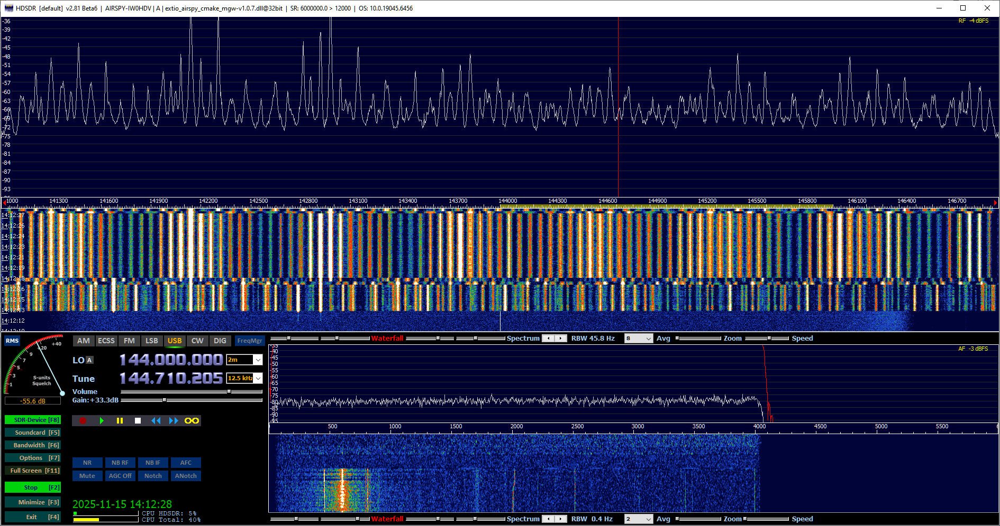
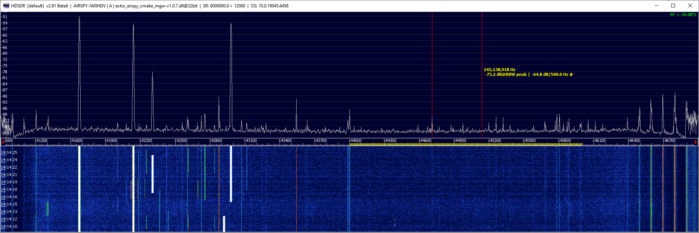

# Helical Filter for SAT Reception

My location is pretty noisy on all bands. In particular, the
[King City station of Land Mobile Radio Network](https://www.radioreference.com/db/site/42847)
continuously transmits several trunked signals between 141 and 143 MHz. These signals are so strong
that the SDR receivers are overloaded, and no reception on the 2m band is possible:

When the receiver gain is turned down to prevent clipping, weak signal reception is no longer possible,
but at least the offending signals become visible on the band scope.

