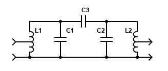
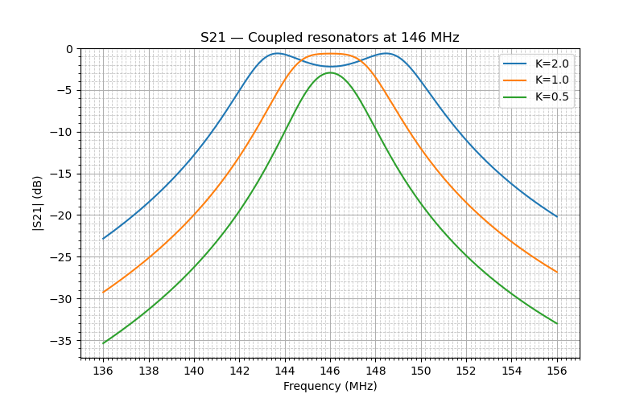
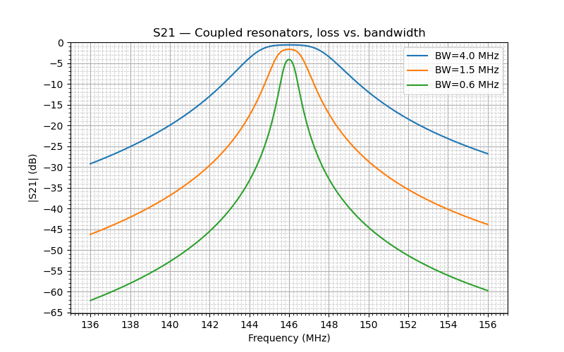
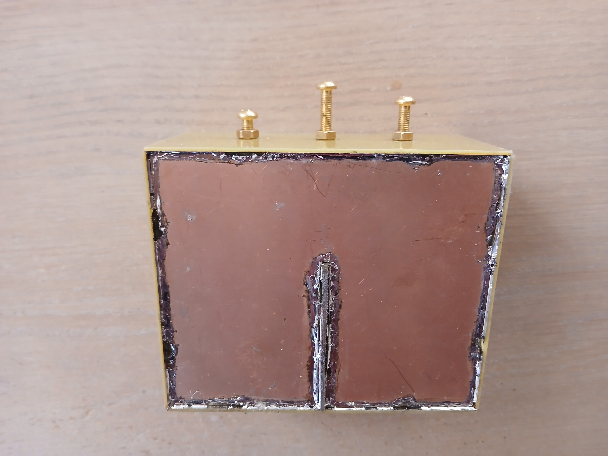
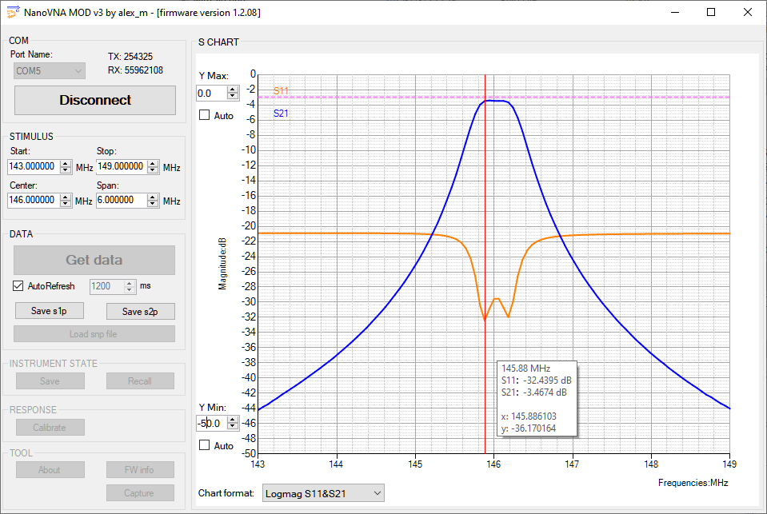
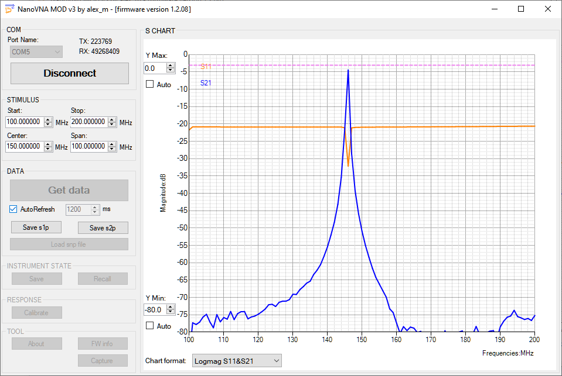
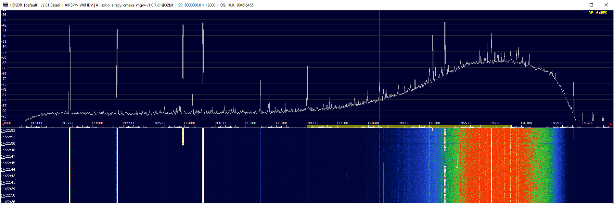

# Helical Filter for Satellite Reception

## Interference

My location is pretty noisy on all bands. In particular, the
[King City station of Land Mobile Radio Network](https://www.radioreference.com/db/site/42847)
continuously transmits trunked signals on the frequencies close to the 144 MHz band. These signals are so strong that the SDR receivers are constantly overloaded, and no reception on the 2m band is possible. I tried RTL-SDR, RSP1a and Airspy Mini, none of these receivers were able receive in the presence of those signals. I added a
[Minikits preamp](https://www.minikits.com.au/electronic-kits/rf-amplifiers/rf-preamplifiers/eme220-2m)
with a narrowband front end filter, but this did not help.

Here is what Airspy Mini receives with its gain is set to a high value:

*Click on the image to enlarge.*

When the receiver gain is turned all the way until the clipping is gone, weak signal reception is no longer possible, but at least the offending signals become visible on the band scope:

*Click on the image to enlarge.*

There are multiple channels between 141 MHz and 143 MHz that produce a rich set of combinational products when clipped.

I was interested in receiving the satellite signals in the range of 145.8 - 146 MHz. With only 3 MHz spacing between the interference and the signals of interest, I needed a very narrowband filter to separate them. It looked like a
[helical resonator](https://en.wikipedia.org/wiki/Helical_resonator) -
based filter could do the job.

## Theory

### Helical Resonator

A helical resonator, and different filters based on it, are described in this book:

[Anatol I. Zverev, Handbook of filter synthesis, Wiley, 1967](files/zverev.pdf)

According to Zverev, a helical resonator "resembles a coaxial quarter-wave resonator, except that the
inner conductor is in the form of a single-layer solenoid, or helix. The helix is enclosed in a highly
conductive shield of either circular or square cross-section. One lead of the helical winding is connected directly to the shield and the other end is open circuited."

A passband filter consisting of two helical resonators looks like this:

### Equivalent Circuit

 The passband filter shown above has the following equivalent circuit:

In a real filter there are no capacitors: the helixes are self-resonant, and the coupling between them is achieved through stray capacitance (C3).

### The Coupling Coefficient

The capacitance of C3 determines the coupling coefficient K:

*Click on the image to enlarge.*

- at the low values of K the filter response is bell-shaped, and the signal loss in the passband is significant;
- as K increases, the loss decreases, and the bandwidth slightly increases;
- at K=1 the top of the frequency response flattens, and the losses reach the minimum;
- further increase of K widens the passband and creates two peaks in its frequency response.

K=1, called critical coupling, provides the best combination of filter shape, bandwidth and passband losses.

### Resonator Loading

There is a common misconception that the position of the taps on the coils determines the input and output impedance of the filter. This is not true. Whatever impedance transformation occurs at the filter input, the inverse of that occurs at the output. The tap position, however, is important as it determines the loading of the resonator ( Q_unloaded / Q_loaded) and thus controls the trade-off between the filter bandwidth and its losses. When we increase the loading, we reduce the losses in the passband at the expense of widening the filter passband.

The chart below shows the frequency response of a two-resonator helical filter with different tap positions. In this example, when the tap is placed at a point where the filter loss is about 0.5 dB, the bandwidth of the filter is 4 MHz. As the tap moves lower on the helix, the resonator loading decreases, the losses increase, and the bandwidth decreases. When the loss reaches 3.5 dB, the bandwidth goes down to 600 kHz.

If the filter is located after the preamp, a few dB of loss is an acceptable price for a narrow bandwidth and higher rejection in the stopband.

*Click on the image to enlarge.*

## Design

There are several calculators that compute the dimensions of the filter:

- [Coil64](https://coil32.net/online-calculators/helical-resonator-bandpass-filter.html);
- [Helical Bandpass Filter Designer](https://www.changpuak.ch/electronics/Helical_Bandpass_Filter_Designer.php);
- [Helical](https://web.archive.org/web/20250109193926/https://www.tonnesoftware.com/helical.html).

I used Coil64 for this project. In general, the larger the filter, the higher unloaded Q is achieved, assuming that the relations between all dimensions are optimal. I decided to use a 1/4" (6.35 mm) copper tube for the helix, the largest diameter that was practical, and computed all other dimensions as follows:

### Input Data

| Parameter | Value | Description |
|---|---|---|
|f0 |146| MHz  –  Working frequency|
|ΔF |0.3| MHz  –  Bandwidth-3dB|
|α  |3| dB  –  Admissible loss in the passband|
|Ri |50| Ω  –  Input impedance|
|Ru |50| Ω  –  Output Impedance|

### Results

| Parameter | Value | Description |
|---|---|---|
| Qu |1692| – Unloaded Q of the resonator |
| Z0 |239| – The characteristic impedance of the resonator [Ω] |
| α0 |3.5| – Estimated losses in the passband [dB] |

### Geometry

| Parameter | Value | Description |
|---|---|---|
| d |39| mm – Diameter of the helix |
| b |59| mm – The length of the helix |
| S |59| mm – The width of the box shield |
| H |95| mm – The height of the box shield |
| τ |12.5| mm – The helix winding pitch |
| d0 |6.2| mm – The diameter of the wire |
| N |4.7| mm – Number of turns of the helix |
| tapi |0.04| mm – Input tap (number of turns) |
| tapu |0.04| mm – Output tap (number of turns) |
| h |5.1| mm – Helix above of shielding wall |
| K |71.1| mm – The height of shielding wall |

## Construction

It was not difficult to source all required materials from the local and online sources:

- 1/4" copper tube, 2m;
- one-sided copper clad PCB, 150x100 mm, 5 pieces;
- two-sided PCB, 65x60 mm;
- M5 brass machine screw and nut, 3 pieces each;
- SMA female jack, 2 pcs.

I tried to make all dimensions accurate down to 0.5 mm, and took care to prevent damaging the conducting surfaces. I did not sand the PCB and tinned the edges of the walls as little as possible since solder has lower conductivity than copper. To make the coils, I filled the tube with sand and wound it on a plastic pipe of a suitable diameter.

The height of the wall between the resonators had to be 71 mm, but the largest piece of two-sided PCB that I had was only 60 mm high, so I used it. I had to add a 20x20 mm piece on top of it to bring the coupling between the resonators in the desired range.

The two machine screws were added to tune the resonators to the desired frequency, and the third screw in the center was used to adjust the coupling.

*Click on the image to enlarge.*

The closing lid of the filter was attached with the copper on the outer side, to allow soldering it to the shield. Initially I soldered it only at two points per edge, since I had to remove it many times to make the adjustments. Once all work was finished, I soldered it completely along all edges, but this did not change any of filter's characteristics, so obviously this was not necessary.

*Click on the image to enlarge.*

## Measurements

The measurements performed with **NanoVNA** and
[NanoVNA software mod V3](https://www.rtl-sdr.com/forum/viewtopic.php?f=4&t=4881&p=12524#p12524)
proved that the calculations performed with Coil64 were less than perfect. The resonant frequency of the resonators was 20 MHz below the specs, I had to cut small pieces of the tube from the helixes several times until I brought the frequency to the ballpark. The final number of turns was 4.06 vs. 4.7 calculated.

The unloaded Q of the resonators proved to be around 950, less than claimed by Coil64 (1692), despite all precautions that I took to preserve high Q, but still good enough for my purposes.

The position of the tap, adjusted for the desired loss in the passband, was 5 mm from the bottom end of the helix, on the straight part of the tube.

The screw in the middle proved to be invaluable in achieving the critical coupling. Changing the tap positions changed the coupling as well, but it was easy to bring it back using the screw.

The final result was quite satisfying. the loss in the passband, 3.5 dB, was acceptable, due to the preamp in front of the filter, and the interference at 141-143 MHz was suppressed by 40 to 50 dB.

Here is a screenshot of the band scope taken with the filter in place. The clipping is gone, there are no combinational products, and the satellite segment of 145.8-146 MHz is clean:

*Click on the image to enlarge.*
